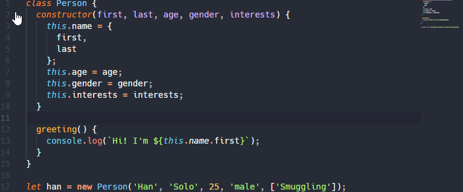
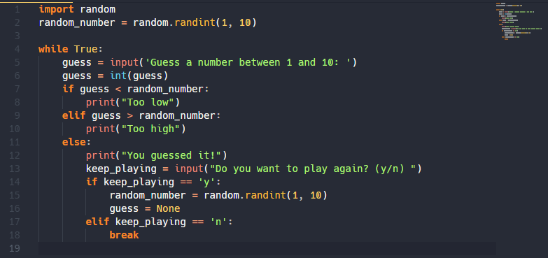

# README

+ Customized version of the 'Ayu Mirage'-Theme.
+ Added bold and italic font
+ Brighter colors

**Enjoy!**

**Examples:**

**html:**

**js:**

**python:**

Font used:
[Hack](https://github.com/source-foundry/Hack)

***python multiline-comment-workaround:***  
edit your vscode settings.json:  
<pre><code>
"editor.tokenColorCustomizations": {  
        "[Ayu Mirage PowerUp]":{  
          "textMateRules":[  
            {  
              "scope": "string.quoted.docstring.multi.python",  
              "settings":{  
                "foreground": "#5c6773"  
               }  
            }  
          ]  
        }  
    }  
}
</code></pre>
